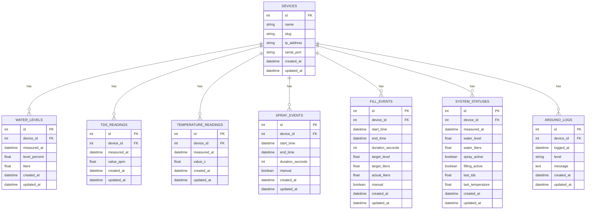

# Growdash - Laravel 12 Integration

Laravel-basiertes Dashboard zur Verwaltung und Überwachung von Growdash-Geräten (Arduino-basierte Hydroponik-Systeme).

## Projektübersicht

Dieses Projekt integriert mehrere Growdash-Geräte in eine zentrale Laravel-Anwendung. Jedes Gerät sendet Sensordaten (Wasserstand, TDS, Temperatur) und Events (Sprüh- und Füllvorgänge) via Webhooks an Laravel. Die Anwendung:

-   **Empfängt und persistiert** Sensordaten und Logs von mehreren Geräten
-   **Parst Arduino-Log-Messages** automatisch und extrahiert strukturierte Daten
-   **Verwaltet System-Status** in Echtzeit (letzter Wasserstand, TDS, Temperatur, aktive Prozesse)
-   **Stellt APIs bereit** für Historien, Status-Abfragen und manuelle Steuerung
-   **Sichert Webhooks ab** via Token-basierter Authentifizierung

## Datenmodell (ER-Diagramm)



### Konzept

-   **devices**: Zentrale Tabelle für alle Growdash-Geräte (1:n zu allen Messungen/Events)
-   **system_statuses**: Komprimierte "aktueller Status"-Tabelle für schnelle Abfragen
-   **Historien-Tabellen**: Alle Messungen und Events werden vollständig gespeichert
-   **arduino_logs**: Rohdaten aller Arduino-Nachrichten für Debugging

## Installation & Setup

### 1. Dependencies installieren

```bash
composer install
npm install
```

### 2. Environment konfigurieren

Kopiere `.env.example` zu `.env` und setze folgende Werte:

```env
# Growdash-Konfiguration
GROWDASH_DEVICE_SLUG=growdash-1
GROWDASH_WEBHOOK_TOKEN=super-secret-token-hier-einfügen
GROWDASH_PYTHON_BASE_URL=http://192.168.178.12:8000
```

### 3. Datenbank migrieren

```bash
php artisan migrate
```

### 4. Initial-Device erstellen (optional)

```bash
php artisan db:seed --class=DeviceSeeder
```

## API-Dokumentation

### Webhook-Endpunkte (erfordern `X-Growdash-Token` Header)

#### POST `/api/growdash/log`

Empfängt einzelne Log-Zeilen vom Arduino.

**Request:**

```json
{
    "device_slug": "growdash-1",
    "message": "WaterLevel: 75.3",
    "level": "info"
}
```

#### POST `/api/growdash/event`

Empfängt strukturierte Events (optional, falls Python bereits parst).

**Request:**

```json
{
    "device_slug": "growdash-1",
    "type": "water_level",
    "payload": {
        "level_percent": 75.3,
        "liters": 15.2,
        "measured_at": "2025-12-01T10:30:00Z"
    }
}
```

#### POST `/api/growdash/manual-spray`

Manuelles Aktivieren/Deaktivieren der Sprühfunktion.

**Request:**

```json
{
    "device_slug": "growdash-1",
    "action": "on"
}
```

#### POST `/api/growdash/manual-fill`

Manuelles Starten/Stoppen des Füllvorgangs.

**Request:**

```json
{
    "device_slug": "growdash-1",
    "action": "start",
    "target_level": 80.0,
    "target_liters": 20.0
}
```

### Öffentliche API-Endpunkte

#### GET `/api/growdash/status?device_slug=growdash-1`

Aktueller System-Status.

**Response:**

```json
{
    "water_level": 75.3,
    "water_liters": 15.2,
    "spray_active": false,
    "filling_active": true,
    "last_tds": 450.2,
    "last_temperature": 22.5,
    "timestamp": 1701424800
}
```

#### GET `/api/growdash/water-history?device_slug=growdash-1&limit=100`

Wasserstand-Historie.

#### GET `/api/growdash/tds-history?device_slug=growdash-1&limit=100`

TDS-Wert-Historie.

#### GET `/api/growdash/temperature-history?device_slug=growdash-1&limit=100`

Temperatur-Historie.

#### GET `/api/growdash/spray-events?device_slug=growdash-1&limit=50`

Sprüh-Events.

#### GET `/api/growdash/fill-events?device_slug=growdash-1&limit=50`

Füll-Events.

#### GET `/api/growdash/logs?device_slug=growdash-1&limit=200`

Arduino-Logs.

## Todo-Liste

### ✅ Phase 1: Basis-Infrastruktur

-   [x] README.md mit ER-Diagramm und Projektdokumentation
-   [x] .env.example mit Growdash-Variablen
-   [x] config/services.php Growdash-Konfiguration

### ✅ Phase 2: Sicherheit & Middleware

-   [x] VerifyGrowdashToken Middleware erstellen
-   [x] Middleware in bootstrap/app.php registrieren

### ✅ Phase 3: Datenbank

-   [x] Migration: devices
-   [x] Migration: water_levels
-   [x] Migration: tds_readings
-   [x] Migration: temperature_readings
-   [x] Migration: spray_events
-   [x] Migration: fill_events
-   [x] Migration: system_statuses
-   [x] Migration: arduino_logs
-   [x] Alle Migrations ausführen

### ✅ Phase 4: Models

-   [x] Model: Device (mit allen Relations)
-   [x] Model: WaterLevel
-   [x] Model: TdsReading
-   [x] Model: TemperatureReading
-   [x] Model: SprayEvent
-   [x] Model: FillEvent
-   [x] Model: SystemStatus
-   [x] Model: ArduinoLog

### ✅ Phase 5: Controller & Routen

-   [x] GrowdashWebhookController mit allen Methoden
-   [x] API-Routen in routes/api.php
-   [x] Routen testen (manuell oder via Tests)

### ✅ Phase 6: Seeders & Test-Daten

-   [x] DeviceSeeder für Initial-Devices
-   [ ] Optional: Test-Daten-Seeder für Entwicklung

### ✅ Phase 7: Tests

-   [x] Feature-Test: Webhook-Authentifizierung
-   [x] Feature-Test: Log-Parsing (WaterLevel, TDS, Temp)
-   [x] Feature-Test: Event-Handling
-   [x] Feature-Test: Status-API
-   [x] Feature-Test: History-APIs
-   [x] Feature-Test: Manual-Control (Spray/Fill)

### 📋 Phase 8: Authentifizierung & Autorisierung

-   [x] API-Endpunkte mit Auth-Middleware absichern
-   [x] Tests mit Authentifizierung aktualisiert
-   [ ] Policy für Device-Zugriff erstellen
-   [ ] Benutzer-Device-Zuordnung (optional)

### 📋 Phase 9: Frontend (Livewire + Flux)

-   [x] Design-Konzept erstellt (DESIGN.md)
-   [ ] Dashboard-View mit Device-Liste
-   [ ] Echtzeit-Status-Anzeige
-   [ ] Manuelle Steuerungs-Buttons (Spray/Fill)
-   [ ] Charts für Historien (Water, TDS, Temperature)
-   [ ] Event-Timeline
-   [ ] Log-Viewer mit Filtering

### 📋 Phase 10: WebSockets & Echtzeit

-   [x] WebSocket-Konzept dokumentiert (WEBSOCKETS.md)
-   [x] Laravel Reverb installiert (composer require laravel/reverb)
-   [ ] ⚠️ BLOCKIERT: reverb:install hängt - Terminal prüfen und ggf. Ctrl+C, dann manuell durchführen
-   [ ] Broadcasting-Events erstellen (DeviceStatusUpdated, NewLogReceived)
-   [ ] Events in Controller integrieren
-   [ ] Frontend: WebSocket-Listener implementieren
-   [ ] Echtzeit-Chart-Updates

---

## 🚀 NEUE ANFORDERUNG: Multi-Tenant-Architektur

### ✅ Phase 11: User-Device-Beziehungen

-   [x] Migration: user_id zu devices_table hinzufügen
-   [x] Migration: public_id (UUID) zu devices_table
-   [x] Migration: agent_token zu devices_table (für Agent-Auth)
-   [x] Device Model um User-Relation erweitern
-   [x] DevicePolicy erstellen (user_id === auth()->id())
-   [x] Policy in AppServiceProvider registrieren
-   [x] Alle API-Endpunkte mit Policy absichern
-   [x] Tests mit user_id aktualisiert
-   [x] DeviceSeeder angepasst (admin@growdash.local / password)
-   [x] Migration ausgeführt
-   [x] Alle 65 Tests bestanden ✅

-   [ ] Migration: user_id zu devices_table hinzufügen
-   [ ] Migration: public_id (UUID) zu devices_table
-   [ ] Migration: agent_token zu devices_table (für Agent-Auth)
-   [ ] Optional: users_devices Pivot-Tabelle für Team-Sharing
-   [ ] Device Model um User-Relation erweitern
-   [ ] DevicePolicy erstellen (user_id === auth()->id())
-   [ ] Alle API-Endpunkte mit Policy absichern

### Phase 12: Generische Sensor/Actuator-Framework

**Ziel**: Hardcodierte Sensoren (water, TDS, temp) durch generisches System ersetzen

-   [ ] Migration: sensors_table (device_id, type, name, config JSON)
-   [ ] Migration: actuators_table (device_id, type, name, config JSON)
-   [ ] Migration: measurements_table (sensor_id, value, unit, measured_at)
-   [ ] Migration: actuations_table (actuator_id, action, params JSON, executed_at)
-   [ ] Model: Sensor (polymorphische Typen: water_level, tds, temperature, custom)
-   [ ] Model: Actuator (polymorphische Typen: spray, fill, custom)
-   [ ] Model: Measurement (ersetzt WaterLevel, TdsReading, TemperatureReading)
-   [ ] Model: Actuation (ersetzt SprayEvent, FillEvent)
-   [ ] SensorTypeEnum/ActuatorTypeEnum für Typ-Validierung
-   [ ] Data Migration: Alte Daten → neue Struktur migrieren

### Phase 13: Device-Provisioning & Handshake

**Ziel**: Neue Devices registrieren und mit Benutzern verknüpfen

-   [ ] Livewire Component: DeviceRegistration (Name, Type, Slug eingeben)
-   [ ] POST /api/devices/provision (erstellt Device + generiert agent_token)
-   [ ] GET /api/devices/{public_id}/handshake (Agent-Auth via agent_token)
-   [ ] Handshake-Response: sensor_config, actuator_config, polling_interval
-   [ ] View: Device-Setup-Wizard mit QR-Code für agent_token
-   [ ] Agent-seitiges Setup-Skript (Python) für Ersteinrichtung

### Phase 14: Telemetrie & Command-Queue APIs

**Ziel**: Generische APIs für Agent-Communication

-   [ ] POST /api/devices/{public_id}/telemetry (Array von Measurements)
-   [ ] GET /api/devices/{public_id}/commands (Pending Commands abrufen)
-   [ ] PATCH /api/devices/{public_id}/commands/{id} (Command als ausgeführt markieren)
-   [ ] Migration: commands_table (device_id, type, params JSON, status, created_at)
-   [ ] Model: Command (status: pending/executing/completed/failed)
-   [ ] Controller: TelemetryController (ersetzt GrowdashWebhookController)
-   [ ] Controller: CommandController (Queue-Management)
-   [ ] Agent-Polling-Mechanismus dokumentieren (HTTP Long-Polling vs. WebSocket)

### Phase 15: Multi-Tenant-Frontend

**Ziel**: UI für Device-Management und Monitoring

-   [ ] Livewire: DeviceList (nur eigene Devices anzeigen)
-   [ ] Livewire: DeviceCard (Status, Sensor-Werte, Actuator-Controls)
-   [ ] Livewire: CommandHistory (gesendete Befehle + Status)
-   [ ] Livewire: SensorChart (generisch für alle Sensor-Typen)
-   [ ] Livewire: ActuatorControl (generische Buttons für Actuators)
-   [ ] View: devices/index.blade.php (Dashboard)
-   [ ] View: devices/show.blade.php (Device-Detail mit Charts)
-   [ ] View: devices/provision.blade.php (Setup-Wizard)

### Phase 16: Auth-Policies & Team-Sharing (Optional)

-   [ ] DevicePolicy: viewAny, view, update, delete, control
-   [ ] Middleware: EnsureDeviceOwnership für alle Device-Routes
-   [ ] Optional: Team-Model für Multi-User-Zugriff
-   [ ] Optional: Invitation-System für Device-Sharing
-   [ ] Optional: Role-Based-Access (owner, admin, viewer)

## Offene Entscheidungen

### ✅ Entscheidungen getroffen:

1. **System-Status-Strategie**: ✅ Ein Status pro Device (wird überschrieben) - optimal für schnelle Abfragen
2. **API-Authentifizierung**: ✅ Auth-Middleware wird für öffentliche Endpunkte hinzugefügt
3. **Frontend-Framework**: ✅ Livewire + Flux (bereits im Projekt vorhanden)
4. **Echtzeit-Updates**: ✅ WebSockets mit Laravel Reverb
5. **Multi-Tenant-Architektur**: ✅ User-Device-Beziehungen über user_id + public_id (UUID)
6. **Sensor-Framework**: ✅ Generische Sensor/Actuator-Tabellen statt hardcodierte Typen

### ⚠️ Neue Entscheidungen erforderlich:

1. **Team-Sharing**: Sollen Devices mit mehreren Usern geteilt werden können? (Pivot-Tabelle users_devices)
2. **Agent-Auth**: Token-basiert via agent_token oder API Keys mit Sanctum?
3. **Command-Delivery**: HTTP Long-Polling vs. WebSocket für Command-Queue?
4. **Data-Migration**: Alte Daten (water_levels, tds_readings) in neue measurements_table migrieren oder parallel behalten?

## Technologie-Stack

-   **Backend**: Laravel 12, PHP 8.3+
-   **Database**: MySQL/PostgreSQL/SQLite (konfigurierbar)
-   **Frontend**: Livewire 3.x + Flux UI
-   **Echtzeit**: Laravel Reverb (WebSockets)
-   **Testing**: Pest PHP
-   **Python-Interface**: HTTP Webhooks + REST API
-   **Multi-Tenancy**: User-Device-Ownership + Policies
-   **IoT-Framework**: Generische Sensor/Actuator-Abstraktion

## Architektur-Prinzipien

1. **Multi-Tenant**: Strikte User-Device-Isolation via Policies
2. **Multi-Device-Ready**: Alle Tabellen sind auf device_id normalisiert
3. **Generische IoT-Abstraktion**: Sensor/Actuator-Framework für beliebige Geräte
4. **Event-Sourcing-Light**: Vollständige Historie aller Messungen
5. **Status-Caching**: system_statuses für schnelle Abfragen
6. **Webhook-Sicherheit**: Token-basierte Authentifizierung (agent_token)
7. **Parser-Flexibilität**: Unterstützt sowohl rohe Logs als auch strukturierte Events
8. **API-Sicherheit**: Authentifizierte Endpunkte mit Policies
9. **Provisioning-Flow**: Device-Registrierung via UI + Agent-Handshake
10. **Command-Queue**: Bidirektionale Communication (UI → Agent)

---

**Projekt-Status**: 🚀 Phase 10 (WebSocket-Setup läuft) + Phase 11-16 (Multi-Tenant-Erweiterung geplant)  
**Aktuelles Problem**: ⚠️ Terminal hängt bei `php artisan reverb:install` - siehe Troubleshooting unten  
**Letzte Aktualisierung**: 2025-12-01

---

## 🔧 Troubleshooting: Reverb-Installation

**Problem**: `php artisan reverb:install` hängt im Terminal

**Mögliche Ursachen**:

1. **Interaktive Prompts**: Der Befehl wartet auf Eingaben (z.B. "Soll config/reverb.php überschrieben werden?")
2. **Migration läuft**: Datenbank-Migration kann bei großen Tabellen lange dauern
3. **Prozess hängt**: Echter Deadlock oder Timeout

**Lösungen**:

```powershell
# 1. Terminal prüfen: Wartet der Befehl auf Input? Dann:
y # Drücken um fortzufahren

# 2. Falls wirklich eingefroren: Ctrl+C und manuell durchführen
php artisan vendor:publish --tag=reverb-config
php artisan vendor:publish --tag=reverb-migrations
php artisan migrate

# 3. Broadcasting-Events manuell erstellen
php artisan make:event DeviceStatusUpdated
php artisan make:event NewLogReceived
php artisan make:event SprayEventStarted
```

**Nächste Schritte nach Reverb-Fix**:

1. Events erstellen (siehe WEBSOCKETS.md)
2. Controller-Integration testen
3. Dann: Multi-Tenant-Migration starten (Phase 11)
