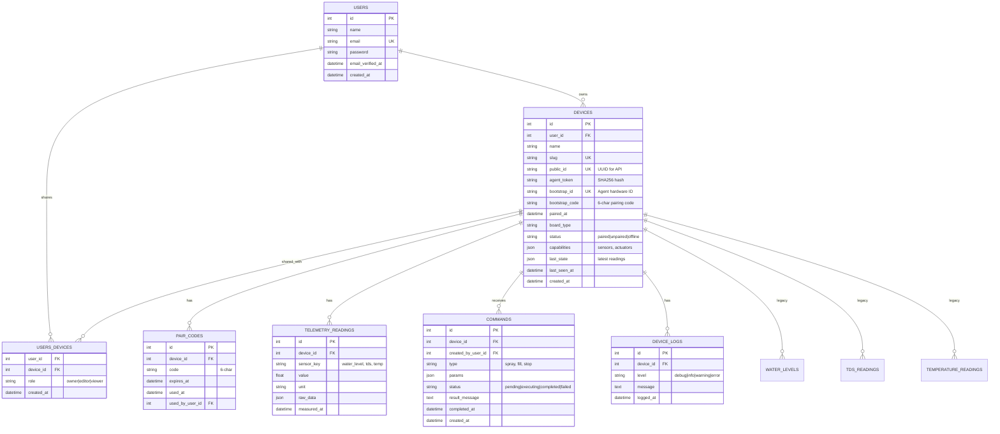

# Growdash - Laravel 12 Multi-Tenant IoT Platform

Laravel-basiertes Dashboard zur Verwaltung und Überwachung von Growdash-Geräten (Arduino-basierte Hydroponik-Systeme) mit vollständiger Multi-Tenant-Architektur, Device-Provisioning, Team-Sharing und sicherer Agent-Authentifizierung.

## Projektübersicht

Dieses Projekt integriert mehrere Growdash-Geräte in eine zentrale Laravel-Anwendung mit:

-   **Multi-Tenant-Architektur**: Jeder User verwaltet eigene Devices, optional Team-Sharing via Pivot-Tabelle
-   **Device-Provisioning**: Bootstrap-Flow für neue Geräte mit 6-stelligem Pairing-Code
-   **Agent-Authentifizierung**: SHA256-gehashte Tokens für sichere Device-Communication
-   **Generische Telemetrie**: JSON-basierte Sensor-/Actuator-Konfiguration
-   **Command-Queue**: Bidirektionale Steuerung (UI → Agent → UI)
-   **WebSocket-Support**: Echtzeit-Updates via Laravel Reverb (geplant)

## Datenmodell (ER-Diagramm)



### Architektur-Konzepte

-   **Multi-Tenancy**: `user_id` in `devices`, Policies prüfen Owner oder `users_devices` Pivot-Rolle
-   **Bootstrap-Flow**: Agent sendet `bootstrap_id` → Server generiert `bootstrap_code` → User pairt via UI → Agent erhält `public_id` + `agent_token`
-   **Token-Sicherheit**: `agent_token` wird als SHA256-Hash gespeichert, Klartext nur beim Pairing zurückgegeben (einmalig!)
-   **Generische Telemetrie**: `telemetry_readings` ersetzt alte `water_levels`, `tds_readings`, etc. (migration geplant)
-   **Command-Queue**: UI erstellt Commands → Agent pollt `/api/growdash/agent/commands/pending` → sendet Ergebnis zurück

## Installation & Setup

### 1. Dependencies installieren

```bash
composer install
npm install
npm run build
```

### 2. Environment konfigurieren

Kopiere `.env.example` zu `.env`:

```env
APP_NAME=GrowDash
APP_URL=http://localhost

DB_CONNECTION=sqlite
DB_DATABASE=/absolute/path/to/database.sqlite

# Growdash Legacy (optional für Webhooks)
GROWDASH_WEBHOOK_TOKEN=super-secret-token
```

### 3. Datenbank migrieren

```bash
php artisan migrate
```

### 4. Test-User erstellen

```bash
php artisan db:seed --class=UserSeeder
# → admin@growdash.local / password
```

## API-Dokumentation

### 🔐 Bootstrap & Pairing (Multi-Tenant-Flow)

#### 1️⃣ Agent Bootstrap (öffentlich)

**POST** `/api/agents/bootstrap`

Agent sendet beim ersten Start seine Hardware-ID und wartet auf Pairing.

**Request:**

```json
{
    "bootstrap_id": "esp32-abc123def456",
    "name": "GrowBox Kitchen",
    "board_type": "ESP32",
    "capabilities": {
        "sensors": ["water_level", "tds", "temperature"],
        "actuators": ["spray", "fill"]
    }
}
```

**Response (unpaired):**

```json
{
    "status": "unpaired",
    "bootstrap_code": "XY42Z7",
    "message": "Device registered. Please pair via web UI with code: XY42Z7"
}
```

**Response (paired, nach User-Pairing):**

```json
{
    "status": "paired",
    "public_id": "9b1deb4d-3b7d-4bad-9bdd-2b0d7b3dcb6d",
    "agent_token": "7f3d9a8b...64-char-plaintext-token...c2e1f4a6",
    "device_name": "GrowBox Kitchen",
    "user_email": "admin@growdash.local"
}
```

⚠️ **WICHTIG**: `agent_token` wird nur EINMAL zurückgegeben! Agent muss ihn in `.env` speichern.

---

#### 2️⃣ User Pairing (auth:web)

**POST** `/api/devices/pair`

User gibt 6-stelligen Code ein, um Device mit Account zu verknüpfen.

**Request:**

````json
{
    "bootstrap_code": "XY42Z7"
**Response:**
```json
{
    "success": true,
    "message": "Device paired successfully!",
    "device": {
        "id": 1,
        "name": "GrowBox Kitchen",
        "public_id": "9b1deb4d-3b7d-4bad-9bdd-2b0d7b3dcb6d",
        "paired_at": "2025-12-01T16:42:00Z"
    },
    "agent_token": "7f3d9a8b...64-char-plaintext-token...c2e1f4a6"
}
````

⚠️ **WICHTIG**: Agent muss nach erfolgreichem Pairing `agent_token` UND `public_id` in seiner `.env` speichern!

---

### 🤖 Agent API (Device-Authenticated)

Alle Agent-Endpoints erfordern folgende Header:

```
X-Device-ID: 9b1deb4d-3b7d-4bad-9bdd-2b0d7b3dcb6d
X-Device-Token: 7f3d9a8b...64-char-plaintext-token...c2e1f4a6
```

#### POST `/api/growdash/agent/telemetry`

Agent sendet Sensor-Readings (geplant, Controller fehlt noch).

**Request:**

```json
{
    "readings": [
        {
            "sensor_key": "water_level",
            "value": 75.3,
            "unit": "percent",
            "measured_at": "2025-12-01T10:30:00Z"
        },
        {
            "sensor_key": "tds",
            "value": 450.2,
            "unit": "ppm",
            "measured_at": "2025-12-01T10:30:00Z"
        }
    ]
}
```

#### GET `/api/growdash/agent/commands/pending`

Agent holt pending Commands ab (geplant, Controller fehlt noch).

**Response:**

```json
{
    "commands": [
        {
            "id": 42,
            "type": "spray",
            "params": { "duration": 10 },
            "created_at": "2025-12-01T16:40:00Z"
        }
    ]
}
```

#### POST `/api/growdash/agent/commands/{id}/result`

Agent meldet Command-Ergebnis zurück (geplant).

**Request:**

```json
{
    "status": "completed",
    "result_message": "Spray cycle completed successfully"
}
```

---

### 📊 Legacy Webhook-Endpunkte (deprecated, erfordern `X-Growdash-Token`)

#### POST `/api/growdash/log`

Empfängt einzelne Log-Zeilen vom Arduino (legacy).

**Request:**

```json
{
    "device_slug": "growdash-1",
    "message": "WaterLevel: 75.3",
    "level": "info"
}
```

#### POST `/api/growdash/manual-spray`

Manuelles Aktivieren/Deaktivieren der Sprühfunktion (legacy).

**Request:**

```json
{
    "device_slug": "growdash-1",
    "action": "on"
}
```

### Öffentliche API-Endpunkte

#### GET `/api/growdash/status?device_slug=growdash-1`

Aktueller System-Status.

**Response:**

```json
{
    "water_level": 75.3,
    "water_liters": 15.2,
    "spray_active": false,
    "filling_active": true,
    "last_tds": 450.2,
    "last_temperature": 22.5,
    "timestamp": 1701424800
}
```

#### GET `/api/growdash/water-history?device_slug=growdash-1&limit=100`

Wasserstand-Historie.

#### GET `/api/growdash/tds-history?device_slug=growdash-1&limit=100`

TDS-Wert-Historie.

#### GET `/api/growdash/temperature-history?device_slug=growdash-1&limit=100`

Temperatur-Historie.

#### GET `/api/growdash/spray-events?device_slug=growdash-1&limit=50`

Sprüh-Events.

#### GET `/api/growdash/fill-events?device_slug=growdash-1&limit=50`

Füll-Events.

#### GET `/api/growdash/logs?device_slug=growdash-1&limit=200`

Arduino-Logs.

## Todo-Liste

### ✅ Phase 1: Basis-Infrastruktur

-   [x] README.md mit ER-Diagramm und Projektdokumentation
-   [x] .env.example mit Growdash-Variablen
-   [x] config/services.php Growdash-Konfiguration

### ✅ Phase 2: Sicherheit & Middleware

-   [x] VerifyGrowdashToken Middleware erstellen
-   [x] Middleware in bootstrap/app.php registrieren

### ✅ Phase 3: Datenbank

-   [x] Migration: devices
-   [x] Migration: water_levels
-   [x] Migration: tds_readings
-   [x] Migration: temperature_readings
-   [x] Migration: spray_events
-   [x] Migration: fill_events
-   [x] Migration: system_statuses
-   [x] Migration: arduino_logs
-   [x] Alle Migrations ausführen

### ✅ Phase 4: Models

-   [x] Model: Device (mit allen Relations)
-   [x] Model: WaterLevel
-   [x] Model: TdsReading
-   [x] Model: TemperatureReading
-   [x] Model: SprayEvent
-   [x] Model: FillEvent
-   [x] Model: SystemStatus
-   [x] Model: ArduinoLog

### ✅ Phase 5: Controller & Routen

-   [x] GrowdashWebhookController mit allen Methoden
-   [x] API-Routen in routes/api.php
-   [x] Routen testen (manuell oder via Tests)

### ✅ Phase 6: Seeders & Test-Daten

-   [x] DeviceSeeder für Initial-Devices
-   [ ] Optional: Test-Daten-Seeder für Entwicklung

### ✅ Phase 7: Tests

-   [x] Feature-Test: Webhook-Authentifizierung
-   [x] Feature-Test: Log-Parsing (WaterLevel, TDS, Temp)
-   [x] Feature-Test: Event-Handling
-   [x] Feature-Test: Status-API
-   [x] Feature-Test: History-APIs
-   [x] Feature-Test: Manual-Control (Spray/Fill)

### 📋 Phase 8: Authentifizierung & Autorisierung

-   [x] API-Endpunkte mit Auth-Middleware absichern
-   [x] Tests mit Authentifizierung aktualisiert
-   [ ] Policy für Device-Zugriff erstellen
-   [ ] Benutzer-Device-Zuordnung (optional)

### 📋 Phase 9: Frontend (Livewire + Flux)

-   [x] Design-Konzept erstellt (DESIGN.md)
-   [ ] Dashboard-View mit Device-Liste
-   [ ] Echtzeit-Status-Anzeige
-   [ ] Manuelle Steuerungs-Buttons (Spray/Fill)
-   [ ] Charts für Historien (Water, TDS, Temperature)
-   [ ] Event-Timeline
-   [ ] Log-Viewer mit Filtering

### 📋 Phase 10: WebSockets & Echtzeit

-   [x] WebSocket-Konzept dokumentiert (WEBSOCKETS.md)
-   [x] Laravel Reverb installiert (composer require laravel/reverb)
-   [ ] ⚠️ BLOCKIERT: reverb:install hängt - Terminal prüfen und ggf. Ctrl+C, dann manuell durchführen
-   [ ] Broadcasting-Events erstellen (DeviceStatusUpdated, NewLogReceived)
-   [ ] Events in Controller integrieren
-   [ ] Frontend: WebSocket-Listener implementieren
-   [ ] Echtzeit-Chart-Updates

---

## 🚀 Multi-Tenant-Architektur (Phase 11-16)

### ✅ Phase 11: User-Device-Beziehungen & Bootstrap/Pairing

-   [x] Migration: user_id, public_id (UUID), agent_token zu devices
-   [x] Migration: bootstrap_id, bootstrap_code, paired_at zu devices
-   [x] Migration: capabilities (JSON), last_state (JSON), status, board_type
-   [x] Migration: users_devices Pivot-Tabelle für Team-Sharing (role: owner/editor/viewer)
-   [x] Migration: pair_codes Tabelle für Pairing-Codes
-   [x] Migration: telemetry_readings für generische Sensor-Daten
-   [x] Migration: commands für Command-Queue (type, params, status)
-   [x] Migration: device_logs für Agent-Logs
-   [x] Device Model: pairWithUser() mit SHA256-Token-Hashing
-   [x] Device Model: verifyAgentToken() für Hash-Vergleich
-   [x] Device Model: sharedUsers() BelongsToMany-Relation
-   [x] User Model: devices() + sharedDevices() Relations
-   [x] BootstrapController: bootstrap() Endpoint (öffentlich)
-   [x] DevicePairingController: pair() Endpoint (auth:web)
-   [x] AuthenticateDevice Middleware für Agent-Auth (X-Device-ID + X-Device-Token)
-   [x] API Routes: /api/agents/bootstrap, /api/devices/pair, /api/growdash/agent/\*
-   [x] DevicePolicy: view/update/delete prüfen user_id oder users_devices pivot
-   [x] DevicePolicy: control() erlaubt owner + shared users mit editor/owner role
-   [x] Policy in AppServiceProvider registriert
-   [x] README.md mit ER-Diagramm und API-Dokumentation aktualisiert

**Status**: ✅ Phase 11 abgeschlossen! Bootstrap/Pairing-Flow funktioniert, Agent-Auth implementiert, Multi-Tenant-Policies aktiv.

---

### 📋 Phase 12: Agent-API Controller implementieren

-   [ ] TelemetryController: store() für /api/growdash/agent/telemetry
-   [ ] CommandController: pending() für /api/growdash/agent/commands/pending
-   [ ] CommandController: result() für /api/growdash/agent/commands/{id}/result
-   [ ] DeviceManagementController: updateCapabilities(), heartbeat()
-   [ ] LogController: store() für /api/growdash/agent/logs
-   [ ] API Routes aktivieren (aktuell auskommentiert)

### 📋 Phase 13: Data Migration & Cleanup

-   [x] Migration: measurements_table erstellt (unified sensor data)
-   [x] Migration: migrate_legacy_sensor_tables_to_measurements erstellt
-   [ ] Migration ausführen und alte Daten migrieren
-   [ ] Legacy-Tabellen deprecaten (water_levels, tds_readings, temperature_readings)
-   [ ] Legacy-Models entfernen nach erfolgreicher Migration

---

## ✅ Architektur-Entscheidungen (getroffen)

### 1. **Team-Sharing**: ✅ Ja, via `users_devices` Pivot-Tabelle

-   **Begründung**: Ermöglicht flexible Zugriffskontrolle (owner/editor/viewer)
-   **Status**: Migration erstellt, Relations implementiert, Policy prüft Pivot-Rollen

### 2. **Agent-Auth**: ✅ Token-basiert via `agent_token` (SHA256-Hash)

-   **Begründung**: Einfacher als Sanctum, direkt in `AuthenticateDevice` Middleware
-   **Status**: Implementiert, Token-Hashing in `pairWithUser()`, Verifikation in Middleware

### 3. **Command-Delivery**: ✅ WebSocket via Laravel Reverb (geplant)

-   **Begründung**: Echtzeit-Push statt Polling, bessere UX für UI und Agent
-   **Status**: Reverb installiert (pending fix), Event-Typen dokumentiert in ARCHITECTURE.md

### 4. **Data-Migration**: ✅ Migrieren und Legacy-Tabellen aufräumen

-   **Begründung**: Unified `measurements` Tabelle skaliert besser, generisches Schema
-   **Status**: Migration erstellt, Ausführung pending

---

## Offene Punkte

1. **Reverb Installation**: ⚠️ `php artisan reverb:install` hängt - manuell publishen oder fix
2. **Agent-API Controller**: TelemetryController, CommandController, DeviceManagementController implementieren
3. **Frontend**: Livewire Components für Device-List, Pairing-UI, Dashboard
4. **WebSocket Events**: DeviceStatusUpdated, CommandCreated, TelemetryReceived

---

## Technologie-Stack

-   **Backend**: Laravel 12, PHP 8.3+
-   **Database**: PostgreSQL/MySQL/SQLite (konfigurierbar)
-   **Frontend**: Livewire 3.x + Flux UI
-   **Echtzeit**: Laravel Reverb (WebSockets) - Installation pending
-   **Testing**: Pest PHP
-   **Multi-Tenancy**: User-Device-Ownership + Pivot-Sharing + Policies
-   **IoT-Auth**: SHA256-gehashte Device-Tokens + Bootstrap/Pairing-Flow
-   **Deployment**: Docker Compose (Production-ready, Port 6480, isoliertes Netzwerk)

## Architektur-Prinzipien

1. **Multi-Tenant**: Strikte User-Device-Isolation via Policies + Team-Sharing via Pivot
2. **Secure Bootstrap**: 6-stelliger Pairing-Code + SHA256-Token-Hashing
3. **Generische Telemetrie**: JSON-basierte Sensor-/Actuator-Konfiguration
4. **Event-Sourcing-Light**: Vollständige Historie aller Messungen in `telemetry_readings`
5. **Command-Queue**: Bidirektionale Communication (UI → Agent → UI)
6. **API-Sicherheit**: Device-Token-Middleware + User-Auth + Policies
7. **Provisioning-Flow**: Agent-Bootstrap → User-Pairing → Device-Auth
8. **WebSocket-Ready**: Laravel Reverb für Echtzeit-Updates (pending setup)

---

**Projekt-Status**: 🚀 **Phase 11 abgeschlossen** - Bootstrap/Pairing/Agent-Auth implementiert, Multi-Tenant-Policies aktiv  
**Nächste Phase**: Phase 12 - Agent-API Controller (Telemetry, Commands, Logs)  
**Production-Deployment**: ✅ Docker Compose ready (Port 6480, isoliertes Netzwerk, Nginx mit gzip)  
**Letzte Aktualisierung**: 2025-12-01 18:30
